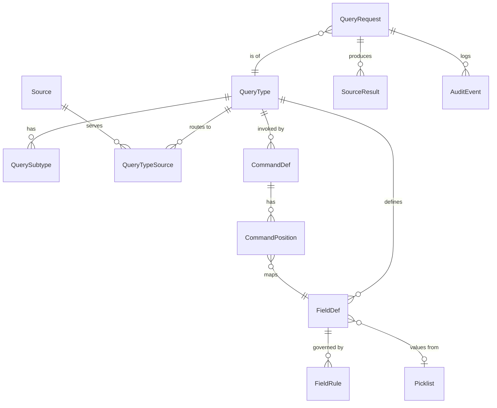

# Requirements Definition: Query Module Usability Enhancements

## A.K.A. Query Module 2.0

# Project Overview Information

This is an enhancement project for the Query Module, a component of a Computer-Aided Dispatch (CAD) suite that lets users query external data sources (e.g., state/national crime information systems, records systems, databases).

- **Elevate User Experience** - Make querying, filtering, visualizing, and interacting with remote data simpler and more empowering for non-technical users.
- **Maintain Security & Regulatory Compliance** - CJIS, GDPR, and other regulatory requirements
- **Boost Reliability & Governance** - Strengthen handling of intermittent connectivity, timeouts, and secure access patterns typical of state and remote environments.
- **Cross-Product** - Review the architecture to determine the best approach to use the Query Module across products, such as the CAD Records system.

### Expected Outcomes

This project will deliver a more robust, high-performing Query Module that integrates critical external state and remote data without compromising security or governance. Users will experience fewer roadblocks when configuring request and response data.

Improving backend foundations and leveraging current technology (AI) to simplify site-specific extension development enables the implementation team to more easily configure site-specific request and response data to meet customer requirements, reducing development and implementation effort and lowering the cost to implement this solution. With thoughtful UX upgrades, we enhance the user experience for each persona, improving overall perception of the CAD suite.

# Proposed Solution

Points of consideration:

- User experience enhancements
    - Simplifying the user's ability to perform common queries
    - Identify user experience enhancement based on the user persona:
        - CAD Dispatch users
        - CAD Mobile Unit users
        - CAD Mobile app users
            - App in the foreground
            - App in the background
    - Easily identify required fields per query type
        - Add conditions for required fields
        - The required fields may change depending on whether the query data is in-state or out of state
    - Provide the capability to default values in fields, where applicable
- Improve the ability to configure responses to represent data in an easy-to-read format
    - This format may vary based on persona and form factor
    - Ensure proper keyword highlighting (e.g., Stolen, Wanted)
    - Horizontal vs. Vertical orientation to accommodate different form factors and avoid text wrapping
- Simplify the implementation and configuration efforts
    - Provide a simple method to map response data to specific elements to be rendered
    - Allow full customization capability for site-specific configuration purposes
    - Ability to map Query Module response data to the proper supplemental field
- Simplify the site-specific extension development efforts
- Simplify the central development team's efforts
- Ensure scalability related to various query types (e.g., nested queries, one request that queries multiple sources, etc.)
- Maintain compliance with security and regulatory regulations
    - Ensure proper auditing for compliance
    - Provide an acknowledgment that a query was received for auditing or troubleshooting purposes
    - Ensure secure authentication & access controls, with the ability to change required credentials
    - Audit logging and traceability
- Ensure a user-friendly method allows users to provide remote system login credentials
    - Ensure there is a user-friendly method to change provider credentials to maintain compliance with security and regulatory requirements
    - Need the ability for users to enter credentials for the state system
        - A workflow for this is a training officer with a new hire, but the new hire hasn't been CJIS-certified yet. Therefore, the trainee logs in to CAD Dispatch or the CAD Mobile Unit, but the training officer needs to log in to the state system.
- Ability to delete individual or multiple responses from the user's view
    - The information remains in the database for auditing and compliance purposes
- Provide an architecture that better supports cross-product usage
    - Consider re-architecting the Query Module as an add-on rather than embedding it in a single product.
    - Allows for easy deployment and implementation when used by Records-only customers
- Provide a terminal emulator that can be added to a layout
    - Implementation can define the command delimiter
    - Implementation would define the entire command string, so when the user enters that command string, they perform a specific query type and subtype against the selected sources
        - For example, the user enters: NAM.LASTNAME.FIRSTNAME.RACE.SEX.DOB and presses enter
        - A specific query type/subtype is performed against the selected source
        - Skipping a position would be allowed
        - Default values could be inserted if a position is skipped
            - i.e. VEH.ABC123..26 would perform a license plate query of ABC123 of the default State from the query definition, and the plate's expiration year is 2026.
    - Have the ability to toggle between a form and a terminal emulator
- Investigate aggregating responses.
- Consider voice input control. An in-vehicle array microphone has been reported as reliable in field use, except when a window was down and the siren was active.

# Use Case Examples

**Dispatch Users**

- Dispatch users performing queries
- Dispatch users performing higher-level actions
    - Ad hoc queries
    - Information added to supplemental information
    - Entering/Locating a stolen vehicle
    - Entering/Locating a wanted or missing person
    - Entering/Locating stolen property
    - More…

**Users at a desktop in a stable environment**

- Non-dispatch users performing queries
- Non-dispatch privileged users performing the entering and locating actions

**Mobile Users**

- Mobile users using the CAD Mobile Unit
    - Frequent queries (i.e., license plate check, wanted person, query stolen property, etc.)
        - Performed while either stationary or moving
        - Mobile, and possibly a bumpy environment, smaller screen compared to Dispatch
    - Less frequent queries that are performed more as research while stationary
- Mobile app users using CAD Mobile
    - App in the foreground - access to frequent query types
    - App in the background - access to frequent query types
    - Requires minimal clicks
    - Barcode or OCR scanning to scan a license plate or registration bar code
    - Scan a VIN
    - Scan a serial number from an object, such as a serial number from a gun

# **Person Lookup – Use Case Scenarios**

## **Dispatch User (Desktop / Stable Environment)**

### **Standard Person Lookup**

- User performs a person query using structured fields (Name, DOB, Sex, Race).
- Required fields dynamically adjust based on **query type and jurisdiction (in-state vs. out-of-state)**.
- Default values (e.g., state) are auto-populated to reduce input effort.
    - Site-configurable for defaulting values
- Results are displayed in a **configurable, easy-to-read format** with key indicators (e.g., *Wanted*, *Missing*) highlighted.
- The app provides query acknowledgment and a notification when results are returned.

### **Advanced / Ad Hoc Query**

- User executes multi-source or nested queries (e.g., a driver's license query + a wanted person query).
- Ability to use **terminal-style commands** (e.g., `NAM.LAST.FIRST.DOB`) or toggle to a form-based interface.
- Supports skipping fields with default values.
- The app provides query acknowledgment and a notification when results are returned.

### **High-Priority Workflow**

- User identifies a **wanted or missing person**.
- System highlights critical keywords and presents actionable data.
- The user can append results to **supplemental records**.
- The app provides query acknowledgment and a notification when results are returned.

## **CAD Mobile Unit User (Vehicle Laptop)**

### **Quick Lookup (Frequent Queries)**

- User performs a rapid person lookup with **minimal clicks**.
- Optimized for **horizontal/vertical layouts** depending on user preference.
    - Client-side user settings based on user preferences
    - Save to the user profile
- Required fields simplified; defaults applied automatically.
- The app provides query acknowledgment and a notification when results are returned.

### **Lookup in Motion**

- Supports use in **mobile and unstable environments**.
- Voice input, OCR, or limited-entry forms reduce manual typing.
- Results formatted for **quick scanning**, with critical flags prominently displayed.
- The app provides query acknowledgment and a notification when results are returned.

### **Research Mode (Stationary)**

- User performs deeper queries with expanded filters and multi-source results.
- Ability to toggle between **summary view and detailed records**.
- The app provides query acknowledgment and a notification when results are returned.

## **CAD Mobile App User (Smartphone)**

### **Foreground Quick Access**

- User launches app and performs **frequent lookups** (e.g., name + DOB).
- UI optimized for **touch input and small screen**.
- Auto-fill, predictive text, and minimal required fields enhance speed.
- The app provides query acknowledgment and a notification when results are returned.

### **Background Quick Access**

- The user has the mobile app in the background.
- The user initiates a lookup while the app is in the background (e.g., a traffic stop).
- The app provides query acknowledgment and a notification when results are returned.

### **Scan-Based Lookup**

- User scans an ID, barcode, or document to automatically populate fields.
- Reduces input errors and speeds up query execution.
- Scans a driver's license, registration paperwork, or VIN
    - Should support OCR
    - Barcode scanning

# **Vehicle Lookup – Use Case Scenarios**

## **Use Case 1: Plate-Only Lookup**

**Description**

Allows a user to perform a vehicle query using only the license plate when system configuration supports plate-only searches.

**Preconditions**

- User has access to the vehicle lookup interface.
- System configuration allows queries using only the plate field.

**Main Flow**

1. User navigates to the **Plate Form** via:
    1. Quick access button, **or**
    2. Standard Query Module tab.
2. System ONLY displays the initial input form with the following fields:
    1. Plate
    2. State
    3. Year
    4. VIN
    5. Default values can be configured for fields depending on site-specific requirements
3. User enters a **Plate number**
    1. If the state is changed from the default, expose more fields, such as plate type
    2. The system dynamically evaluates the entered data against configuration rules.
    3. System updates the form:
        - Displays additional required fields (if applicable).
        - Marks them as **mandatory**.
    4. User completes all required fields.
    5. Additional site-specific or custom fields should be able to be added to this expanded section
4. User submits the form by:
    - Pressing **Enter**, or
    - Clicking **Submit**.
5. System processes the request.
6. An acknowledgment is sent confirming that the request has been received

**System Behavior**

- Based on the backend configuration, the system submits all queries that require **only the plate**.
- No additional fields are enforced or displayed if not required by configuration.

---

# **Property Inquiry – Use Case Scenarios**

## **Dispatch User (Desktop / Stable Environment)**

### **Standard Property Lookup**

- User performs a query for **stolen property** using structured inputs (e.g., serial number, property type, description).
- Required fields dynamically adjust based on:
    - Property type (vehicle, firearm, electronics, etc.)
    - Jurisdiction (in-state vs. out-of-state)
- Default values (e.g., state, agency) are pre-filled where applicable.
- Results displayed in a **configurable, structured format** with highlighted keywords (e.g., *Stolen*, *Recovered*).
- Property type should be a picklist of values to choose from.
    - This picklist should allow sites to narrow the list for site-specific requirements.

### **Advanced / Multi-Source Query**

- User executes queries across **multiple systems (state, national, local)**.
- Terminal emulator option:

```
PROP.TYPE.SERIAL.STATE
```
    - Allows skipping fields with defaults applied.
- Toggle between **form-based and command-based input**.

### **Investigative Workflow**

- User identifies a **match for stolen or recovered property**.
- Adds results to **supplemental records** or case files.
- Formats data for readability with configurable layouts (grid, summary view).

## **CAD Mobile Unit User (Vehicle Laptop)**

### **Quick Property Check**

- User performs **queries** (e.g., serial number or plate lookup).
- System minimizes required input fields and auto-applies defaults.
- Layout adapts to **horizontal or vertical orientation** for readability.

### **Barcode / OCR-Based Lookup**

- User scans:
    - Serial numbers (firearms, electronics)
    - VIN or license plates
- Auto-populates query fields and executes a lookup.
- Reduces typing errors and speeds query execution.

### **Research Mode**

- User performs more detailed property searches:
    - Expanded filters (type, location, status)
- Ability to switch between **summary and detailed views**.

## **CAD Mobile App User (Smartphone)**

### **Foreground Quick Lookup**

- User performs common property queries with:
    - Minimal taps
    - Auto-filled/defaulted values
- UI optimized for a **small screen form factor**.
- Frequently used query types accessible from the home screen.

### **Background Query Execution**

- User initiates property lookup during another activity.
- System:
    - Acknowledges query submission
    - Notifies the user when results are available
- Ensures full **audit logging and traceability**.

### **Scan-Based Lookup**

- User uses the camera to scan:
    - Barcodes
    - Serial numbers
- System extracts text via OCR and executes the query.

# **Shared Functional Scenarios**

### **Dynamic Field Management**

- Required fields and validation rules adapt based on:
    - Query type
    - Jurisdiction (in-state vs. out-of-state)
- Conditional logic simplifies user input and reduces errors.

### **Response Configuration**

- Data mapped to configurable UI components.
- Persona-specific formatting:
    - Dispatch → detailed, multi-pane view
    - Mobile → condensed, high-visibility layout
- Supports keyword highlighting (e.g., *Stolen*, *Wanted*).

### **Data Management**

- Users can:
    - Delete responses from their view
    - Retain records in the backend for **audit/compliance**

### **Authentication & Credential Handling**

- Secure login.
- Ability to:
    - Enter and update **state system credentials**
    - Support **training workflows** (e.g., trainee + training officer dual access)
        - Extends to other multi-user workflows

### **Audit & Compliance**

- Every query:
    - Logged with timestamps and user identity
    - Provides acknowledgment of receipt
- Full traceability for CJIS and regulatory compliance.
- Ensures **audit logging and traceability**.

## **Terminal Emulator Use Case**

### **Command-Based Query Entry**

- User enters structured command:

```
NAM.LASTNAME.FIRSTNAME.RACE.SEX.DOB
```
- System parses input and executes the corresponding query.
- Supports:
    - Skipped fields with defaults
    - Configurable delimiters and command mappings
- The user can toggle between **terminal mode and form mode**.

## **Cross-Platform & Architectural Considerations**

- The Query Module functions as a **modular add-on service** across products (Dispatch, Mobile, Records).
- Enables:
    - Consistent query experience
    - Easier deployment for different customer types
- Scalable to support:
    - Multi-source queries
    - Nested queries
    - High transaction volumes

# Platform Dependencies

A separate, related initiative is establishing a **Shared Platform**: a common technology and data-sharing layer for CAD Dispatch, CAD Records, Mobile Field Reporting, CAD Mobile, and future applications. Where that platform provides a capability, the Query Module should use it rather than build its own. This lets the Query Module run as a true cross-product add-on.

## Shared Platform Capabilities the Query Module Depends On

- **Identity & authorization** — a shared service that enforces consistent access control across all products. The Query Module should use it for user identity and query permissions, including the delegated-credential (training officer) workflow.
- **Common data model** — shared core entities (incidents, units, personnel, records). Supplemental data from query responses should be written to these shared entities.
- **Integration pattern (APIs/events)** — a standard REST API and/or event pattern. Query requests, acknowledgments, per-source results, and notifications should use it.
- **Centralized audit logging** — consistent audit logging of data access across products. Query Module audit events should go to this shared service instead of a separate product-specific log.

## Principles Applied to the Query Module

- **Shared over duplicated** — identity, data access, notifications, and audit live once in the Shared Platform, not in the Query Module.
- **Incremental adoption** — the Query Module must keep working through existing product integrations while the Shared Platform is adopted gradually.
- **Backward compatibility** — existing integrations stay in place until the platform replacements are validated. No new dependencies should be added on the legacy integration layer.

## Additional Use Cases

**Dispatch-Only Customers**

- The Shared Platform is deployed with CAD Dispatch. The Query Module plugs into the platform alongside other Dispatch-adjacent interfaces (e.g., ANI/ALI).

**Records-Only Customers**

- The Query Module is deployed with CAD Records only, with no Dispatch. Queries, responses, and supplemental data use the Shared Platform's REST API instead of legacy Records services.

**Mobile Field Reporting**

- Field personnel run queries from Mobile Field Reporting through the Shared Platform. They get the same query experience and data whether the agency runs Dispatch + Records or Records only.

**CAD Mobile App**

- CAD Mobile runs queries and receives results and notifications through the Shared Platform's REST API/events instead of legacy service integrations.

# Acceptance Criteria

- Simplify central development team efforts
- Simplify site-specific extension development efforts
- Simplify implementation efforts
- Add logic to requests to identify required fields
    - Per site
- Add logic to requests to support defaulting values in fields
    - Per site
- Provide a simple input method for the most frequent queries
    - Accounting for the user environment (e.g. while driving and moving, walking, on a bicycle, wearing gloves, etc.)
- Simplify the customization support for responses
    - Quickly review information
    - Keyword highlighting
    - Site-specific styling based on keywords
- Provide simplified input methods based on persona
    - Dispatch user
    - Mobile Unit user
    - Mobile app user
- Simplify user login for states/sites that require user authentication
    - Ensure compliance with how data is stored and transmitted
    - Provide a user-friendly method to change credentials when required
- Auditing
- Localization
- Customization
- Terminal Emulation
- Query request acknowledgement to the requesting user

# Licensing Information

No new licensing models are required.

# Security Information

- Ensure compliance with CJIS
- Ensure compliance with GDPR
- Ensure compliance with the EU Cyber Resilience Act (?)
- Other regulations?
- Ensure compliance with data storage and transfer requirements
    - Use of encryption when data is at rest or in transit
    - Ensuring secure connections between systems
    - User authentication, where required
    - Multifactor authentication, where required

# Documentation Impact

A full review and refactor is required

# Implementation Impact

Communicate changes ahead of release to ensure implementation understands the scope of work required when upgrading.

# Project Specifications

**Instructions:** Please complete the following table for each requirement (see the comment for each column header that describes the purpose of the column). Note: This table is collaborative, and it is expected that information such as the user story reference number and test case reference numbers be provided to the PM by other teams or added directly to this document.

IMPORTANT! **NEVER** delete a requirement – only use ~~strikethroughs~~ to indicate a requirement has been removed.

**ID prefixes:** BR = Business, FR = Functional, UX = User Experience, SEC = Security/Compliance, NFR = Non-Functional.
**Trace:** the section of this document the requirement comes from. Items marked *Proposed* are not stated in the source requirements; they are recommended additions and need confirmation. **TBD** marks values that still need to be decided.

| **ID** | **Component** | **Sub-Component** | **Requirement Type** ***(Business, Functional, UX, Security, etc)*** | **Requirements Description** | **Trace** |
| --- | --- | --- | --- | --- | --- |
| BR-001 | Platform | Configuration | Business | Common site customizations (required fields, defaults, picklists, response layout, keyword styling, command strings) shall be achievable through configuration, without code changes. | Expected Outcomes; Acceptance Criteria |
| BR-002 | Platform | Deployment | Business | The Query Module shall be deployable as an add-on to CAD Dispatch, CAD Mobile Unit, CAD Mobile, and CAD Records, including Records-only customers. | Proposed Solution; Cross-Platform |
| BR-003 | Platform | Licensing | Business | The enhancements shall not require a new licensing model. | Licensing Information |
| BR-004 | Release | Implementation | Business | Upgrade impact and required configuration changes shall be communicated to implementation ahead of release. | Implementation Impact |
| BR-005 | Release | Documentation | Business | Product documentation shall be fully reviewed and updated to reflect the enhancements. | Documentation Impact |
| FR-001 | Query Forms | Required Fields | Functional | The system shall mark fields as required according to site-configured rules defined per query type. | Proposed Solution; Acceptance Criteria |
| FR-002 | Query Forms | Required Fields | Functional | Required-field rules shall support conditions based on other field values (e.g., State ≠ site default). | Proposed Solution |
| FR-003 | Query Forms | Required Fields | Functional | Required fields shall be able to differ for in-state vs. out-of-state queries. | Proposed Solution; Dynamic Field Management |
| FR-004 | Query Forms | Defaults | Functional | The system shall pre-populate fields with site-configured default values (e.g., State, Agency). | Proposed Solution; Acceptance Criteria |
| FR-005 | Query Forms | Validation | Functional | The system shall prevent submission while required fields are empty and shall identify each missing field to the user. | *Proposed* |
| FR-006 | Query Forms | Submission | Functional | The user shall be able to submit a query form by pressing Enter or clicking Submit. | Vehicle UC1 |
| FR-007 | Query Forms | Quick Access | Functional | Frequent query types shall be reachable from a quick access button as well as the standard Query Module tab. | Vehicle UC1 |
| FR-008 | Query Forms | Custom Fields | Functional | Sites shall be able to add custom fields to a query form, including to conditionally expanded sections. | Vehicle UC1 |
| FR-010 | Vehicle Query | Plate Form | Functional | The plate form shall initially display only Plate, State, Year, and VIN. | Vehicle UC1 |
| FR-011 | Vehicle Query | Plate Form | Functional | When State is changed from the site default, the form shall expose additional configured fields (e.g., Plate Type) and mark any required ones as mandatory. | Vehicle UC1 |
| FR-012 | Vehicle Query | Plate-Only | Functional | When configuration allows plate-only searches, submitting a plate shall execute all configured queries that require only the plate, without enforcing or displaying other fields. | Vehicle UC1 |
| FR-020 | Person Query | Form | Functional | The person form shall support Name (Last, First), DOB, Sex, and Race as structured fields. | Person Lookup |
| FR-030 | Property Query | Form | Functional | The property form shall support serial number, property type, and description. | Property Inquiry |
| FR-031 | Property Query | Picklist | Functional | Property Type shall be a picklist, and sites shall be able to narrow its values. | Property Inquiry |
| FR-032 | Property Query | Required Fields | Functional | Required fields shall be able to vary by the selected property type (e.g., vehicle, firearm, electronics). | Property Inquiry |
| FR-040 | Multi-Source | Routing | Functional | A single user request shall be able to query multiple sources (state, national, local). | Proposed Solution; Property Inquiry |
| FR-041 | Multi-Source | Source Selection | Functional | The user shall be able to select which sources a query is sent to, within the sources configured for that query type. | Proposed Solution (Terminal) |
| FR-042 | Multi-Source | Nested Queries | Functional | The system shall support nested queries, where one request runs several related queries (e.g., driver's license + wanted person). | Proposed Solution; Person Lookup |
| FR-043 | Multi-Source | Per-Source Status | Functional | For a multi-source query, the system shall report the status of each source (pending, returned, failed, timed out) independently. | *Proposed* (Reliability goal) |
| FR-044 | Multi-Source | Timeouts | Functional | Each source shall have a configurable timeout (default TBD), after which the user is told that the source did not respond. | Project Overview (Reliability) |
| FR-045 | Multi-Source | Aggregation | Functional | Investigate combining responses from multiple sources into a single view. (Spike; outcome TBD.) | Proposed Solution |
| FR-050 | Terminal Emulator | Layout | Functional | A terminal emulator component shall be addable to a user layout. | Proposed Solution |
| FR-051 | Terminal Emulator | Delimiter | Functional | The command delimiter shall be site-configurable. | Proposed Solution; Terminal UC |
| FR-052 | Terminal Emulator | Command Mapping | Functional | Sites shall define command strings that map a command code (e.g., `NAM`, `VEH`, `PROP`) and ordered positions to a query type, subtype, and fields. | Proposed Solution; Terminal UC |
| FR-053 | Terminal Emulator | Execution | Functional | Pressing Enter shall parse the command and execute the mapped query against the selected sources. | Proposed Solution |
| FR-054 | Terminal Emulator | Skipped Positions | Functional | An empty position (e.g., `VEH.ABC123..26`) shall be allowed and filled with that field's configured default value, if one exists. | Proposed Solution |
| FR-055 | Terminal Emulator | Errors | Functional | The system shall reject an unrecognized command code, or a command that leaves a required field empty with no default, and shall explain why. | *Proposed* |
| FR-056 | Terminal Emulator | Mode Toggle | Functional | The user shall be able to toggle between terminal mode and form mode. Whether entered values carry over between modes is TBD. | Proposed Solution; Terminal UC |
| FR-060 | Responses | Mapping | Functional | Implementers shall be able to map response data elements to UI rendering elements through configuration. | Proposed Solution; Response Configuration |
| FR-061 | Responses | Supplemental | Functional | The user shall be able to add response data to the correct supplemental field or record. | Proposed Solution; Person/Property Lookup |
| FR-062 | Responses | Delete From View | Functional | The user shall be able to delete one or more responses from their view. | Proposed Solution; Data Management |
| FR-063 | Responses | Retention | Functional | Responses deleted from a user's view shall stay in the database for audit and compliance. | Proposed Solution; Data Management |
| FR-064 | Responses | Acknowledgment | Functional | The system shall send the requesting user an acknowledgment when a query request is received. | Proposed Solution; Acceptance Criteria |
| FR-065 | Responses | Notification | Functional | The system shall notify the requesting user when results are returned, including when the mobile app is in the background. | Person/Property Lookup |
| FR-070 | Mobile | Quick Access | Functional | In CAD Mobile, frequent query types shall be accessible from the home screen with minimal taps. | Property Inquiry (Mobile) |
| FR-071 | Mobile | Background | Functional | The user shall be able to start a lookup while CAD Mobile is in the background. The launch mechanism is TBD (e.g., notification action, widget, voice). | Person/Property Lookup |
| FR-072 | Mobile / Mobile Unit | Barcode | Functional | The system shall scan barcodes (driver's license, registration) to populate query fields. | Use Case Examples; Scan-Based Lookup |
| FR-073 | Mobile / Mobile Unit | OCR | Functional | The system shall use OCR to capture license plates, VINs, and serial numbers (e.g., firearms, electronics) into query fields. | Use Case Examples; Scan-Based Lookup |
| FR-074 | Mobile / Mobile Unit | Scan Execution | Functional | After a scan fills the fields, the system shall run the lookup. Whether the user must confirm first is TBD. | Property Inquiry (Barcode/OCR) |
| FR-075 | Mobile / Mobile Unit | Voice | Functional | Investigate voice input for query entry in vehicles, including performance with road and siren noise. | Proposed Solution; Lookup in Motion |
| UX-001 | Query Forms | Persona Input | UX | Each persona shall have a simplified input method: Dispatch user, Mobile Unit user, and Mobile app user. | Acceptance Criteria |
| UX-002 | Query Forms | Environment | UX | Frequent-query input shall be usable while moving, walking, on a bicycle, or wearing gloves (minimum touch-target size TBD). | Acceptance Criteria |
| UX-003 | Query Forms | Assisted Entry | UX | CAD Mobile shall support auto-fill and predictive text for query fields. | Person Lookup (Mobile App) |
| UX-004 | Query Forms | Required Indicator | UX | Required fields shall be visually distinguished from optional fields. | Proposed Solution |
| UX-010 | Responses | Keyword Highlighting | UX | Site-configured keywords (e.g., WANTED, STOLEN, MISSING, RECOVERED) shall be highlighted in responses. | Proposed Solution; Response Configuration |
| UX-011 | Responses | Keyword Styling | UX | Sites shall be able to set the style used for each keyword or keyword severity. | Acceptance Criteria |
| UX-012 | Responses | Persona Layout | UX | Response layout shall vary by persona and form factor: detailed multi-pane on Dispatch, condensed high-visibility on mobile. | Response Configuration |
| UX-013 | Responses | Orientation | UX | Responses shall support horizontal and vertical layouts to avoid text wrapping on different form factors. | Proposed Solution |
| UX-014 | Responses | User Preference | UX | Layout/orientation preference shall be a client-side user setting saved to the user profile. | Person Lookup (Mobile Unit) |
| UX-015 | Responses | Summary/Detail | UX | The user shall be able to toggle between a summary view and a detailed view of results. | Research Mode |
| UX-016 | Responses | Layout Types | UX | Response layouts shall support at least grid and summary formats. | Property Inquiry (Investigative) |
| SEC-001 | Credentials | Entry | Security | Users shall be able to enter remote/state system credentials through a user-friendly interface. | Proposed Solution; Authentication |
| SEC-002 | Credentials | Change | Security | Users shall be able to change remote system credentials when required (e.g., on expiration). | Proposed Solution; Acceptance Criteria |
| SEC-003 | Credentials | Delegated Credentials | Security | A second user (e.g., a training officer) shall be able to provide state system credentials for queries in a session logged in by another user (e.g., a trainee). | Proposed Solution; Authentication |
| SEC-004 | Credentials | Multi-User | Security | The delegated credential model shall extend to other multi-user workflows beyond training. | Authentication |
| SEC-005 | Authentication | MFA | Security | Multifactor authentication shall be supported where required by the site or remote system. | Security Information |
| SEC-006 | Data Protection | Encryption | Security | Query data and credentials shall be encrypted at rest and in transit. | Security Information |
| SEC-007 | Data Protection | Connections | Security | Connections between the Query Module and remote systems shall be secured. | Security Information |
| SEC-010 | Audit | Query Log | Security | Every query shall be logged with timestamp, requesting user identity, query type/subtype, and target sources. | Proposed Solution; Audit & Compliance |
| SEC-011 | Audit | Credential Identity | Security | When delegated credentials are used, the audit log shall record both the logged-in user and the credential owner. | *Proposed* (follows from SEC-003 + SEC-010) |
| SEC-012 | Audit | Acknowledgment | Security | The audit log shall record when the query was acknowledged and when each source responded. | Audit & Compliance |
| SEC-013 | Audit | Delete From View | Security | Deleting a response from a user's view shall be recorded in the audit log. | *Proposed* (follows from FR-063) |
| SEC-014 | Audit | Traceability | Security | A request, its acknowledgment, and all of its responses shall share a correlation identifier for troubleshooting. | Proposed Solution (Traceability) |
| SEC-020 | Compliance | CJIS | Security | The solution shall comply with the CJIS Security Policy. | Security Information |
| SEC-021 | Compliance | GDPR | Security | The solution shall comply with GDPR where applicable. | Security Information |
| SEC-022 | Compliance | Other | Security | Determine whether the EU Cyber Resilience Act and other regulations apply (TBD). | Security Information |
| NFR-001 | Platform | Localization | Non-Functional | All user-facing text, including configured labels and messages, shall be localizable. | Acceptance Criteria |
| NFR-002 | Platform | Scalability | Non-Functional | The system shall support multi-source queries, nested queries, and high transaction volumes (target volume TBD). | Proposed Solution; Cross-Platform |
| NFR-003 | Platform | Reliability | Non-Functional | The system shall handle intermittent connectivity without losing submitted queries or their audit records. | Project Overview (Reliability) |
| NFR-004 | Platform | Performance | Non-Functional | Acknowledgment of a query request shall reach the user within a target time (TBD). | *Proposed* |
| PLT-001 | Shared Platform | Identity | Architecture | The Query Module shall use the Shared Platform identity & authorization service for user identity and query permissions. | Platform Dependencies |
| PLT-002 | Shared Platform | Identity | Architecture | Delegated state-system credentials (SEC-003) shall be tied to identities managed by the Shared Platform. | Platform Dependencies; *Proposed* |
| PLT-003 | Shared Platform | Data Model | Architecture | Response data added to supplemental information (FR-061) shall be written to Shared Platform core entities (e.g., incident, record, person, vehicle). | Platform Dependencies |
| PLT-004 | Shared Platform | Integration | Architecture | Query requests, acknowledgments, per-source results, and notifications shall use the Shared Platform integration pattern (REST API and/or events). | Platform Dependencies |
| PLT-005 | Shared Platform | Audit | Architecture | Query Module audit events (SEC-010–SEC-014) shall go to the Shared Platform's centralized audit logging service. | Platform Dependencies |
| PLT-006 | Shared Platform | Deployment | Architecture | The Query Module shall run in Dispatch-only, Records-only, and Dispatch + Records deployments, and from Mobile Field Reporting and CAD Mobile. | Platform Dependencies (Use Cases) |
| PLT-007 | Shared Platform | Transition | Architecture | The Query Module shall keep working through existing product integrations while the Shared Platform is adopted incrementally. | Platform Dependencies (Principles) |
| PLT-008 | Shared Platform | Transition | Architecture | New Query Module functionality shall not add dependencies on the legacy integration layer. | Platform Dependencies (Principles) |
| SEC-023 | Compliance | Architecture Review | Security | A formal security architecture review shall be completed before Query Module services that use the Shared Platform move from design to build. | Platform Dependencies |
| SEC-024 | Compliance | Regulated Data | Security | Applicable compliance frameworks (CJIS and state/local requirements) shall be confirmed with Security/Compliance stakeholders before the Query Module sends regulated data through the Shared Platform. | Platform Dependencies |
| BR-006 | Platform | Open Source | Business | Third-party/open-source components (e.g., OCR, barcode, voice libraries) shall be reviewed against the organization's open-source usage policy before adoption. | Platform Dependencies; *Proposed* |
| BR-007 | Release | Documentation | Business | Documentation shall include a Query Module integration/API reference for Shared Platform consumers. | Platform Dependencies |

---

# Appendix A: Prototype Backlog / MVP Scope

The prototype uses a **mock data source** returning canned responses. It does not connect to real state/national systems or use real CJIS data.

## Phase 1 — MVP

| Story | Requirements | Acceptance Criteria (Given / When / Then) |
| --- | --- | --- |
| **A1. Configurable plate form.** As a dispatcher, I want a short plate form with sensible defaults so I can run a plate quickly. | FR-004, FR-006, FR-010 | Given site default State = "TX", when I open the plate form, then I see only Plate, State (= TX), Year, and VIN. When I press Enter with a plate entered, the query submits. |
| **A2. Conditional fields.** As a dispatcher, I want extra fields to appear only when needed. | FR-002, FR-003, FR-011, UX-004 | Given the plate form, when I change State from TX to OK, then Plate Type appears and is marked required. When I change State back to TX, Plate Type is hidden and no longer required. |
| **A3. Required-field validation.** | FR-001, FR-005 | Given a required field is empty, when I submit, then submission is blocked and the empty field is identified. |
| **A4. Terminal parser.** As a power user, I want to type a command instead of using the form. | FR-050–FR-055 | Given `VEH` maps to Plate.State.Year and default State = TX, when I enter `VEH.ABC123..26`, then a vehicle query runs with Plate=ABC123, State=TX, Year=2026. When I enter `XYZ.123`, then I get an "unrecognized command" error. |
| **A5. Form/terminal toggle.** | FR-056 | Given the query panel, when I toggle modes, then I switch between form and terminal. (Carrying values over is TBD.) |
| **A6. Acknowledgment and notification.** | FR-064, FR-065, SEC-014 | Given I submit a query, then I receive an acknowledgment with a correlation ID immediately, and a notification when mock results return. |
| **A7. Keyword highlighting.** | UX-010, UX-011 | Given keywords WANTED (critical) and STOLEN (critical) are configured, when a response contains "STOLEN", then that text is shown in the configured critical style. |
| **A8. Configured response mapping.** | FR-060, UX-015 | Given a response-mapping config, when results return, then the mapped fields render in summary view, and I can expand to the detailed view. |
| **A9. Basic audit log.** | SEC-010, SEC-012 | Given I submit a query, then an audit record is written with user, timestamp, query type, sources, ack time, and response time(s). |

## Phase 2 — Workflow and Compliance

| Story | Requirements | Acceptance Criteria (Given / When / Then) |
| --- | --- | --- |
| **B1. Multi-source query with per-source status.** | FR-040, FR-041, FR-043, FR-044 | Given two mock sources, one of which times out, when I submit, then I see results from the first source and "timed out" for the second. |
| **B2. Nested query.** | FR-042 | Given a person query is configured to also run a wanted check, when I submit a person query, then both results are returned under one correlation ID. |
| **B3. Delegated credentials (training officer).** | SEC-001–SEC-003, SEC-011 | Given a trainee is logged in, when a training officer enters state credentials, then queries use the officer's credentials and the audit log records both users. |
| **B4. Change credentials.** | SEC-002 | Given stored credentials, when I change them, then later queries use the new credentials and the old ones are no longer stored. |
| **B5. Delete responses from view.** | FR-062, FR-063, SEC-013 | Given three responses, when I delete two, then they leave my view, stay in the database, and the deletion is audited. |
| **B6. Add to supplemental.** | FR-061 | Given a response, when I choose "Add to supplemental", then the mapped data is written to the target record's supplemental field. |
| **B7. Property picklist.** | FR-030–FR-032 | Given a site-narrowed property type list, when I open the property form, then only the allowed types appear and required fields change with the selected type. |

## Phase 3 — Mobile and Alternate Input

| Story | Requirements | Acceptance Criteria (Given / When / Then) |
| --- | --- | --- |
| **C1. Condensed mobile layout and orientation.** | UX-012–UX-014 | Given a mobile viewport, when results return, then a condensed layout is shown, and my orientation preference is kept across sessions. |
| **C2. Home-screen quick queries.** | FR-070, UX-002 | Given CAD Mobile, when I open the app, then frequent query types are reachable in one tap, with touch targets meeting the size TBD. |
| **C3. Barcode scan.** | FR-072, FR-074 | Given a driver's license barcode, when I scan it, then the person fields are populated. |
| **C4. OCR scan.** | FR-073, FR-074 | Given a plate/VIN/serial image, when I scan it, then the matching field is populated. |
| **C5. Background lookup.** | FR-065, FR-071 | Given the app is in the background, when I start a lookup (mechanism TBD), then I receive an acknowledgment and a notification when results return. |
| **C6. Voice input spike.** | FR-075 | Record accuracy findings under quiet, road-noise, and siren conditions. |

---

# Appendix B: Generic Data Model

A configuration-driven model so that forms, rules, commands, and response styling come from data rather than code.



## Entities

```text
QueryType        { id, code ("VEH"), name, allowPlateOnly: bool }
QuerySubtype     { id, queryTypeId, code, name }
FieldDef         { id, queryTypeId, key ("plate"), labelKey (localizable), dataType,
                   picklistId?, defaultValue?, visible: bool, required: bool, section ("base" | "expanded") }
FieldRule        { id, fieldId, condition, effect ("show" | "hide" | "require" | "setDefault"), value? }
Picklist         { id, key, values[ { code, labelKey, enabled } ] }        // sites narrow via "enabled"
Source           { id, name, scope ("state" | "national" | "local"), timeoutMs }
QueryTypeSource  { queryTypeId, sourceId, selectedByDefault: bool }
CommandDef       { id, code ("VEH"), queryTypeId, subtypeId?, delimiter (".") }
CommandPosition  { commandDefId, index, fieldId }
KeywordStyle     { keyword, severity ("critical" | "warning" | "info"), style }
ResponseMapping  { queryTypeId, sourceId, persona ("dispatch" | "mobileUnit" | "mobile"),
                   elements[ { responsePath, labelKey, view ("summary" | "detail") } ] }
QueryRequest     { correlationId, queryTypeId, subtypeId?, userId, credentialUserId?,
                   fields{}, sourceIds[], submittedAt, acknowledgedAt }
SourceResult     { correlationId, sourceId, status ("pending" | "returned" | "failed" | "timedOut"),
                   receivedAt?, payload, hiddenForUserIds[] }
AuditEvent       { id, correlationId, type ("submitted" | "acknowledged" | "sourceResponded" |
                   "deletedFromView" | "credentialsChanged"), actorUserId, credentialUserId?, at, details }
UserPreference   { userId, layoutOrientation ("horizontal" | "vertical"), defaultView ("summary" | "detail") }
```

**Shared Platform boundaries:** `userId` and `credentialUserId` come from the Shared Platform identity service. `AuditEvent` is published to the Shared Platform audit service. Supplemental writes target Shared Platform core entities. In the prototype, stand these in with mock interfaces (`IdentityService`, `AuditService`, `EventBus`, `EntityStore`) so real platform services can replace them later.

## Example Configuration: Vehicle Plate Query

```json
{
  "queryType": { "code": "VEH", "name": "Vehicle", "allowPlateOnly": true },
  "fields": [
    { "key": "plate", "dataType": "string", "required": true,  "section": "base" },
    { "key": "state", "dataType": "picklist", "picklist": "states", "defaultValue": "TX", "required": true, "section": "base" },
    { "key": "year",  "dataType": "year",   "required": false, "section": "base" },
    { "key": "vin",   "dataType": "string", "required": false, "section": "base" },
    { "key": "plateType", "dataType": "picklist", "picklist": "plateTypes", "visible": false, "section": "expanded" }
  ],
  "rules": [
    { "field": "plateType", "condition": "state != default(state)", "effect": "show" },
    { "field": "plateType", "condition": "state != default(state)", "effect": "require" }
  ],
  "command": { "code": "VEH", "delimiter": ".", "positions": ["plate", "state", "year"] },
  "keywords": [
    { "keyword": "STOLEN", "severity": "critical" },
    { "keyword": "WANTED", "severity": "critical" }
  ]
}
```

With this config, `VEH.ABC123..26` resolves to `{ plate: "ABC123", state: "TX" (default), year: "2026" }`. Converting two-digit years to four digits is a parsing rule (TBD).

## Open Questions (TBD)

- Rule condition language: a simple expression syntax, or a structured JSON condition?
- Should values carry over when toggling between form and terminal mode?
- Do scan results auto-submit, or require user confirmation?
- How are background lookups launched on mobile?
- Per-source timeout defaults, acknowledgment time target, and transaction-volume targets.
- How long responses deleted from view are retained, and whether that is set per site.
- Whether the EU Cyber Resilience Act and other regulations apply.
